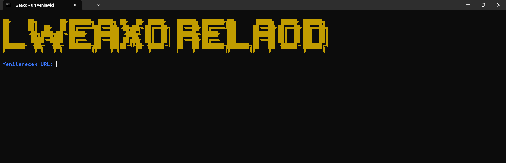
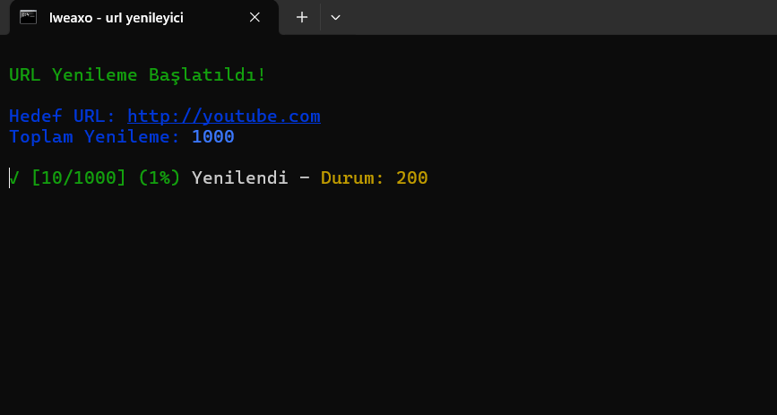
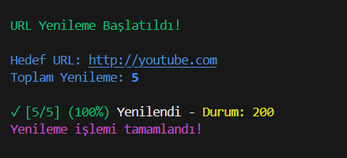

---

<h1 align="center">🚀 URL Refresher 🚀</h1>

<p align="center">
  <i>Basit ama etkili bir terminal aracı ile URL'leri otomatik olarak yenileyin!</i>
</p>

<p align="center">
  
</p>

---

## 🔧 Özellikler

- Kullanıcı dostu terminal arayüzü
- Belirtilen URL'e belirli sayıda GET isteği atar
- Başarılı ve başarısız istekleri canlı olarak gösterir
- Renkli çıktı ile daha iyi okunabilirlik sağlar
- Basit ve hızlı kurulum

---

## 📦 Kurulum

Bu projeyi çalıştırmak için Node.js yüklü olmalıdır. [Node.js indir](https://nodejs.org/)

[](#)

```bash
1. kurulum.bat dosyasını çalıştır.
2. baslat.bat dosyasını çalıştır.
3. proje kullanıma hazır.
````
## 📞 İletişim Destek
[](https://discord.gg/sxWz2fayFa)

> 🔧 **Not:** Eğer çalışmıyorsa, lütfen [Node.js v22](https://nodejs.org/en) sürümünü indirip tekrar deneyin.


## 🚀 Kullanım

Terminali aç ve şu adımları takip et:

1. URL gir (http veya https ile başlamıyorsa otomatik olarak http\:// eklenir)
2. Kaç kez yenilemek istediğini (GET isteği göndermek istediğini) yaz
3. İşlemi canlı olarak takip et

> Örnek:

```bash
Yenilenecek URL: example.com
Yenileme Sayısı: 5
```

🟢 Başarılı istekler ✅ işaretiyle

🔴 Hatalı istekler ❌ işaretiyle gösterilir

---

## 🖼️ Görseller

**Başlangıç Arayüzü:** 

**İşlem Sırasında:** 

**Tamamlandı Mesajı:** 

---

## ⚠️ Uyarılar

* Çok sayıda istek gönderilmesi hedef sunucuda **rate limit** veya **IP engeli** gibi sonuçlar doğurabilir.
* DDoS gibi kötü amaçlı kullanım için tasarlanmamıştır. Sorumluluk kullanıcıya aittir.
* Test ettiğiniz URL'nin gerçekten size ait ya da test izniniz olduğundan emin olun.

---

## Lisans

```yaml
MIT – Lisance
```